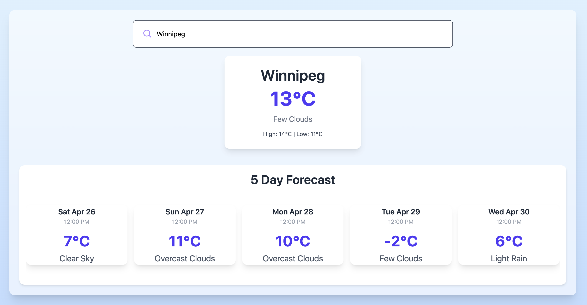

# 🌤️ React Weather App

A sleek and responsive weather application built using **React**, **Vite**, and **Tailwind CSS**, allowing users to search for a city and instantly get the **current weather** and a **5-day forecast** powered by the OpenWeatherMap API.



---

## 🚀 Features

- 🔍 **Live Search** with debouncing for optimized API performance
- 📍 **Current Weather Conditions** (temperature, weather state, highs/lows)
- 📆 **5-Day Forecast** showing daily noon forecasts
- 💅 **Modern UI** built with Tailwind CSS
- 🔁 **Responsive Design** that works across devices

---

## 🔧 Technologies Used

- [React](https://reactjs.org/)
- [Vite](https://vitejs.dev/)
- [Tailwind CSS](https://tailwindcss.com/)
- [OpenWeatherMap API](https://openweathermap.org/)
- JavaScript (ES6+)

---

## 📦 Installation & Setup

1. **Clone the repository**
   ```bash
   git clone https://github.com/Andrew-Ih/weather-app.git
   cd weather-app
   ```

2. **Install dependencies**
   ```bash
   npm install
   ```

3. **Create a `.env.local` file**
   Create a `.env.local` file in the root directory and add your OpenWeatherMap API key:
   ```env
   VITE_WEATHER_API_KEY=your_api_key_here
   ```

4. **Start the development server**
   ```bash
   npm run dev
   ```

   The app should now be running at `http://localhost:5173`

---

## 🌐 API Information

This app uses the **OpenWeatherMap 5-Day / 3-Hour Forecast API**:
```
https://api.openweathermap.org/data/2.5/forecast
```

We filter forecasts to show the **12:00 PM snapshot** for each of the next five days.

We also fetch current weather data from:
```
https://api.openweathermap.org/data/2.5/weather
```

Both APIs are combined using city name queries and the same API key.

---

## 🧠 Debouncing in Live Search

We implemented **debouncing** using `setTimeout` and `clearTimeout` inside a `useEffect` in React:

```jsx
useEffect(() => {
  const delayDebounce = setTimeout(() => {
    if (searchTerm.length > 2) {
      fetch(`https://api.openweathermap.org/data/2.5/weather?q=${searchTerm}&appid=${API_KEY}&units=metric`)
        .then(res => res.json())
        .then(data => {
          setWeatherData(data)
          return fetch(`https://api.openweathermap.org/data/2.5/forecast?q=${searchTerm}&appid=${API_KEY}&units=metric`)
        })
        .then(res => res.json())
        .then(forecast => {
          const dailyMiddayForecasts = forecast.list.filter(item => item.dt_txt.includes("12:00:00"))
          setForecastData(dailyMiddayForecasts)
        })
        .catch(err => console.error('Error fetching data:', err))
    }
  }, 500)

  return () => clearTimeout(delayDebounce)
}, [searchTerm])

**Why this matters:**
- ⛔ Prevents calling the API with every keystroke
- ✅ Only fetches weather data when the user has paused typing
- 🚀 Reduces unnecessary network traffic and improves user experience

---

## 📸 Preview

The app displays:
- A search bar to look up cities
- The current weather summary
- A 5-card forecast display

---

## 📌 To-Do / Improvements

- Add unit conversion toggle (°C/°F)
- Add weather icons
- Add dark mode toggle
- Cache last searched city

---